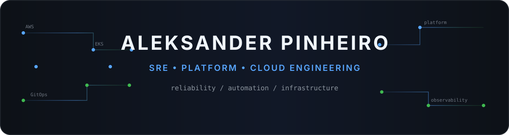
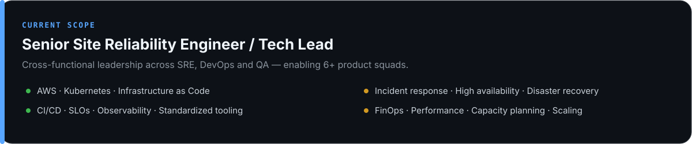
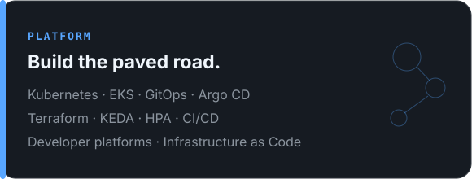
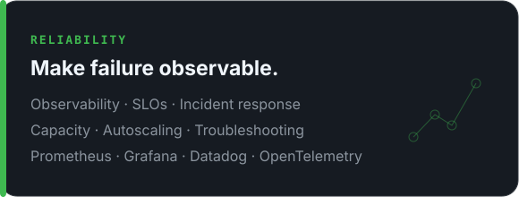
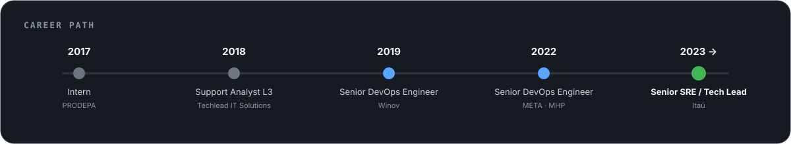
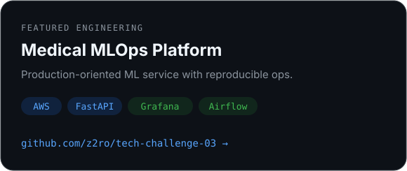
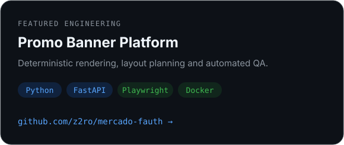
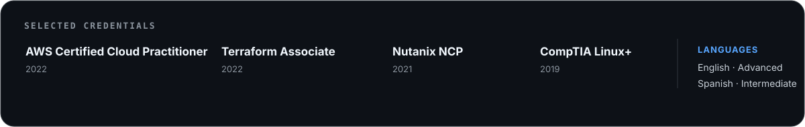

<picture>
  <source media="(prefers-color-scheme: dark)" srcset="./assets/banner-dark.svg">
  <source media="(prefers-color-scheme: light)" srcset="./assets/banner-light.svg">
  
</picture>

<p align="center">
  <a href="https://z2ro.github.io"></a>
  <a href="https://github.com/z2ro"></a>
</p>

<p align="center">
  
  
  
  
  
  
  
  
  
</p>

<picture>
  <source media="(prefers-color-scheme: dark)" srcset="./assets/impact-dark.svg">
  <source media="(prefers-color-scheme: light)" srcset="./assets/impact-light.svg">
  
</picture>

<table>
<tr>
<td width="50%">
<picture>
  <source media="(prefers-color-scheme: dark)" srcset="./assets/platform-dark.svg">
  <source media="(prefers-color-scheme: light)" srcset="./assets/platform-light.svg">
  
</picture>
</td>
<td width="50%">
<picture>
  <source media="(prefers-color-scheme: dark)" srcset="./assets/reliability-dark.svg">
  <source media="(prefers-color-scheme: light)" srcset="./assets/reliability-light.svg">
  
</picture>
</td>
</tr>
</table>

<h3 align="center">Career Path</h3>

<picture>
  <source media="(prefers-color-scheme: dark)" srcset="./assets/career-dark.svg">
  <source media="(prefers-color-scheme: light)" srcset="./assets/career-light.svg">
  
</picture>

<h3 align="center">Featured Engineering</h3>

<table>
<tr>
<td width="50%">
<a href="https://github.com/z2ro/tech-challenge-03">
<picture>
  <source media="(prefers-color-scheme: dark)" srcset="./assets/project-mlops-dark.svg">
  <source media="(prefers-color-scheme: light)" srcset="./assets/project-mlops-light.svg">
  
</picture>
</a>
</td>
<td width="50%">
<a href="https://github.com/z2ro/mercado-fauth">
<picture>
  <source media="(prefers-color-scheme: dark)" srcset="./assets/project-banner-dark.svg">
  <source media="(prefers-color-scheme: light)" srcset="./assets/project-banner-light.svg">
  
</picture>
</a>
</td>
</tr>
</table>

```console
zero@platform:~$ current_focus
reliability / kubernetes / distributed-systems / ai-infra
```

<h3 align="center">Credentials & Languages</h3>

<picture>
  <source media="(prefers-color-scheme: dark)" srcset="./assets/credentials-dark.svg">
  <source media="(prefers-color-scheme: light)" srcset="./assets/credentials-light.svg">
  
</picture>

<h3 align="center">Engineering Activity</h3>

<p align="center">
  
</p>

<h3 align="center">Engineering Notes</h3>

<p align="center">
  SRE · Kubernetes · AWS · Platform Engineering · Distributed Systems
  <br>
  <a href="https://z2ro.github.io"><strong>z2ro.github.io →</strong></a>
</p>

<p align="center">
  <sub>Building reliable systems, reducing operational complexity, and making infrastructure easier to operate.</sub>
</p>
